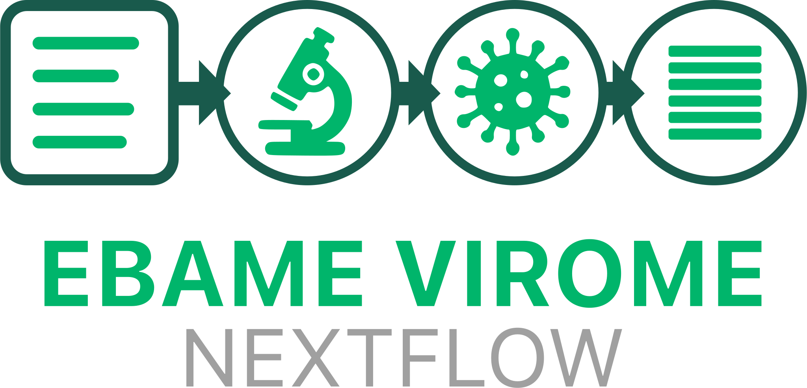

# nfvir



A simple viromics pipeline to mine viral genomes in a metagenome based on the [EBAME Viromics workshop](https://corebio.info/ebame-viromics/).

## Overview

This Nextflow pipeline processes metagenomic assemblies to identify, quality-check, dereplicate, and quantify viral genomes. It implements the following workflow:

1. **Viral identification** - Uses geNomad to identify viral sequences in the assembly
2. **Quality assessment** - Runs CheckV to evaluate viral sequence quality
3. **Dereplication** - Clusters viral sequences at 95% ANI with 85% alignment fraction
4. **Read mapping** - Maps reads to dereplicated vOTUs using minimap2

## Requirements

- Nextflow >= 23.04.0
- Docker, Singularity, or Conda
- geNomad database
- CheckV database

## Installation

```bash
# Clone the repository
git clone https://github.com/nfvir/nfvir.git
cd nfvir

# Download geNomad database (if not already available)
genomad download-database .

# Download CheckV database (if not already available)
checkv download-database .
```

## Input

The pipeline requires:

1. **Assembly file** - A co-assembly in FASTA format (can be gzipped)
2. **Reads CSV** - A CSV file with the following structure:

```csv
sampleID,reads_R1,reads_R2
sample1,/path/to/sample1_R1.fastq.gz,/path/to/sample1_R2.fastq.gz
sample2,/path/to/sample2_R1.fastq.gz,/path/to/sample2_R2.fastq.gz
```

## Usage

### Basic usage

```bash
nextflow run main.nf \
  --assembly data/human_gut_assembly.fa.gz \
  --reads data/reads.csv \
  --genomad_db /path/to/genomad_db \
  --checkv_db /path/to/checkv_db \
  --outdir results \
  -profile docker
```

### Using different profiles

```bash
# With Docker
nextflow run main.nf --assembly <assembly> --reads <reads.csv> \
  --genomad_db <db> --checkv_db <db> -profile docker

# With Singularity
nextflow run main.nf --assembly <assembly> --reads <reads.csv> \
  --genomad_db <db> --checkv_db <db> -profile singularity

# With Conda
nextflow run main.nf --assembly <assembly> --reads <reads.csv> \
  --genomad_db <db> --checkv_db <db> -profile conda
```

### Run with test data

```bash
# Make sure you have the databases downloaded first
nextflow run main.nf \
  --genomad_db /path/to/genomad_db \
  --checkv_db /path/to/checkv_db \
  -profile test,docker
```

## Parameters

### Required parameters

| Parameter | Description |
|-----------|-------------|
| `--assembly` | Path to the co-assembly FASTA file |
| `--reads` | Path to the CSV file containing sample reads |
| `--genomad_db` | Path to the geNomad database directory |
| `--checkv_db` | Path to the CheckV database directory |

### Optional parameters

| Parameter | Default | Description |
|-----------|---------|-------------|
| `--outdir` | `./results` | Output directory |
| `--max_cpus` | `16` | Maximum CPUs per job |
| `--max_memory` | `128.GB` | Maximum memory per job |
| `--max_time` | `240.h` | Maximum time per job |

## Output

The pipeline produces the following output directories:

```
results/
├── genomad/              # geNomad outputs (viral identification)
├── checkv/               # CheckV outputs (quality assessment)
├── dereplicated-votus/   # Dereplicated viral sequences
├── alignments/           # BAM files from read mapping
└── pipeline_info/        # Execution reports and logs
```

### Key output files

- `genomad/*_virus.fna.gz` - Identified viral sequences
- `genomad/*_virus_summary.tsv` - Summary of viral sequences
- `checkv/quality_summary.tsv` - Quality metrics for viral sequences
- `dereplicated-votus/vOTU_representatives.fna` - Dereplicated viral OTUs
- `dereplicated-votus/vOTU_clusters.tsv` - Clustering information
- `alignments/*.bam` - Sorted BAM files for each sample

## Pipeline structure

```
nfvir/
├── main.nf                  # Main workflow
├── nextflow.config          # Configuration file
├── nextflow_schema.json     # Parameter schema
├── modules/                 # Process modules
│   ├── genomad.nf          # Viral identification
│   ├── checkv.nf           # Quality assessment
│   ├── dereplicate.nf      # Viral dereplication
│   └── minimap.nf          # Read mapping
├── bin/                     # Helper scripts (exposed to all processes)
└── data/                    # Test data
```

## Test dataset

The `data/` directory contains a small test dataset:

- `human_gut_assembly.fa.gz` - A small metagenomic assembly
- `reads/` - Three paired-end read samples
- `reads.csv` - Sample sheet for the test reads

## Troubleshooting

### Database validation errors

The pipeline validates that:
- geNomad database contains `genomad_mini_db.index`
- CheckV database directory exists

Ensure these files are present in your database directories.

### Memory issues

If you encounter memory errors, adjust the resource limits:

```bash
nextflow run main.nf ... --max_memory 64.GB
```

### Resume failed runs

Nextflow supports resuming from the last successful step:

```bash
nextflow run main.nf ... -resume
```

## Citation

If you use this pipeline, please cite:

- **geNomad**: Camargo et al. (2023) Nature Biotechnology
- **CheckV**: Nayfach et al. (2021) Nature Biotechnology
- **minimap2**: Li (2018) Bioinformatics
- **Nextflow**: Di Tommaso et al. (2017) Nature Biotechnology

## License

MIT License

## Contact

For issues and feature requests, please use the GitHub issue tracker.
